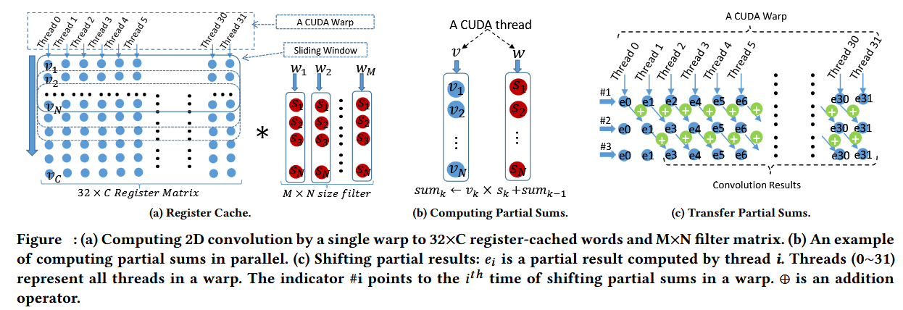
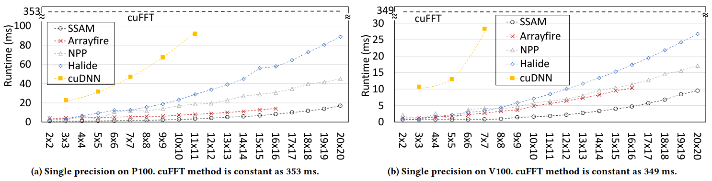

# A Versatile Software Systolic Execution Model for GPU Memory-Bound Kernels
This work proposes a CUDA-based versatile systolic execution model for improving the performance of memory-bound kernels with regular access patterns. A wide class of kernels and applications can benefit from this versatile model: convolution, stencils, scan/reduction operators, Summed Area Tables, . . . etc. The systolic model is based on the transfer and accumulation of partial results in thread- private registers. Additionally, we employ the register files as a cache to avoid using the scratchpad altogether. 
To accumulate and transfer partial sums using thread-private registers, in a SIMT fashion, different groups of threads (known as warps in CUDA) operate over different input points, with some data redundancy that we introduce to account for the halo layers. Differ- ent threads in a warp compute the partial sums, before moving the partial sums to the downstream neighbor thread to be accumulated. To transfer the partial sums, we rely on the warp shuffle primitives that provide low-latency register exchange within a warp. 
To match the high throughput of shuffling the partial sums, we fully utilize the registers for caching the computed partial sums. Accordingly, our model can perform structured grid memory-bound computations at low latency and high throughput. As a result, we can decrease the dependency on scratchpad or cache memory and thus improve the application’s performance by avoiding the scratchpad and cache bottleneck. To avoid overemphasis on intra- warp communication, it is necessary to clarify that we do not limit the use of scratchpad for inter-warp communication. 

For more details, please check the following papers in the docs folder:  
[1] Peng Chen, Mohamed Wahib, Shinichiro Takizawa, Ryousei Takano, Satoshi Matsuoka, “A Versatile Software Systolic Execution Model for GPU Memory-Bound Kernels“, ACM/IEEE Proceedings of the International Conference for High Performance Computing, Networking, Storage and Analysis (SC19)  
 

## Dependency
    
    cuda dirver 410.480
    gcc >=5.4
    cuda-10.0

    mkdir -f ~/local
    cd ~/local
    ln -s WHERE_CUDA10-0 .

## How to compile and run
    git clone GITHUBLINK
    cd setting && ./test-all.sh

## Result

    The results are in the format P100.*.results or V100.*.results

    

## Note
    ssai = ssam

## Help/Support:
For more information or questions, contact the authors at peng.chen.ac#gmail.com (replace # by @, please)
